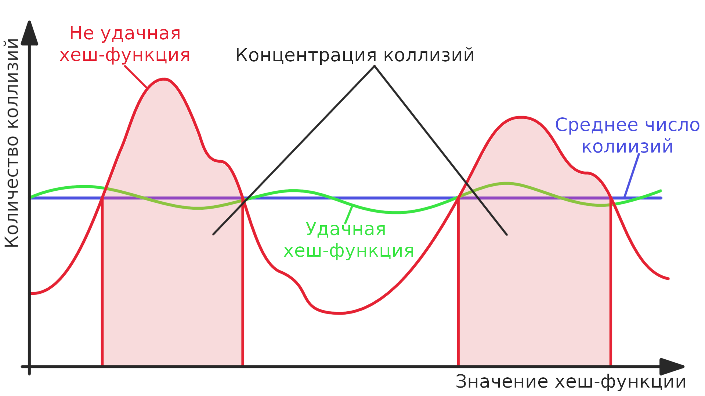

# Хеш-таблица

## Содержание

1. [Цель работы](#цель-работы)
1. [Теоретическое введение](#теоретическое-введение)
1. [Исследование хеш-функций на равномерное распределение коллизий](#исследование-хеш-функций-на-равномерное-распределение-коллизий)

    3.1. [Методика исследования](#методика-исследования)

    3.2. [Предварительный анализ хеш-функций](#предварительный-анализ-хеш-функций)

    3.3. [Проведение измерений и анализ результатов](#проведение-измерений-и-анализ-результатов)

    3.4. [Исследование хеш-фукнций. Вывод](#исследование-хеш-фукнций-вывод)

1. [Оптимизация хеш-таблицы по скорости](#оптимизация-хеш-таблицы-по-скорости)

    4.1. [Общая методика оптимизации](#общая-методика-оптимизации)

    4.2. [Особенности оптимизации хеш-таблицы](#особенности-оптимизации-хеш-таблицы)

    4.3. [Опции компиляции, условия тестирования](#опции-компиляции-условия-тестирования)

    4.4. [Измерение времени работы не оптимизированной программы](#измерение-времени-работы-не-оптимизированной-программы)

    4.5. [Оптимизация типа данных](#оптимизация-типа-данных)

    4.6. [`SSE` оптимизация хеш-функции](#sse-оптимизация-хеш-функции)

    4.7. [Ассемблерная оптимизация](#ассемблерная-оптимизация)

    4.8. [Оптимизация ассемблерной вставкой](#оптимизация-ассемблерной-вставкой)

    4.9. [Исследование максимального прироста производительности](#исследование-максимального-прироста-производительности)

    4.10. [Оптимизация программы. Вывод](#оптимизация-программы-вывод)

## Цель работы

1. Реализовать хеш-таблицу и её базовые функции: поиск элемента, добавление элемента, удаление элемента.

1. Протестировать различные хеш-функций на равномерное распределение коллизий.

1. Оптимизировать хеш-таблицу по скорости аппаратными методами (`SIMD` инструкции, ассемблерная вставка, написание функции на ассемблере). Найти узкие места программы и ускорить работу основных функций: вставки, удаления и поиска.

## Теоретическое введение

`Хеш-таблица` - это структура данных, которая позволяет быстро находить, добавлять и удалять элементы. В среднем поиск, вставка и удаление выполняются за `O(1)`.

Хеш-таблица содержит массив данных. Выполнение операции начинается с вычисления `хеш-функции`, которая каждому значению сопоставляет его индекс в массиве. При этом неизбежны `коллизии` - ситуации когда двум разным значениям хеш-функция сопоставляет один и тот же индекс. Существует два способа разрешения коллизий: `открытая адресация` (более подробную информацию об этом методе можно получить в [интернете](https://ru.wikipedia.org/wiki/Хеш-таблица#Открытая_адресация)) и `метод цепочек`.

В данной работе реализована хеш-таблица методом цепочек. Элементами массива хеш-таблицы являются связные списки. После вычисления хеш-функции, выполняемая операция перенаправляется соответствующему списку. Например, рассмотрим добавление элемента в хеш-таблицу. Сначала вычисляется хеш-функция - её значение будет индексом списка в массиве. Далее элемент добавляется в этот список. Обычно новый элемент добавляют в конец списка. При правильно подобранном размере хеш-таблицы, все списки содержат 1-2 элемента, поэтому поиск чаще всего осуществляется перебором.

<p align="center">
    
    <p align="center">Рисунок 1. Разрешение коллизий методом цепочек.</p>
</p>

В идеальном случае хеш-функция разным элементам хеш-таблицы сопоставляет разные индексы. В реальности это не так. Хеш-функция может обладать `неравномерным распределением коллизий`: функция принимает одно и то же значение для большого набора аргументов. Такие `концентрации коллизий` замедляют работу хеш-таблицы, так как возникают перегруженные элементами списки и операции поиска и удаления начинают выполняться за `O(n)`.

Хеш-функции, обладающие `равномерным распределением коллизий`, позволяют осуществлять операции с хеш-таблицей за примерно одинаковое время. При этом в каждом списке находится почти одно и тоже количество элементов.

Важно отметить, что равномерность распределения коллизий хеш-функции зависит от набора входных данных.

На рисунке приведен пример хеш-функций, имеющих неравномерное и равномерное распределения коллизий.

<p align="center">
    
    <p align="center">Рисунок 2. Распределение коллизий хеш-функций.</p>
</p>

## Исследование хеш-функций на равномерное распределение коллизий

В данной работе будем хранить в таблице слова. Исследуем следующие функции на равномерное распределение коллизий:

1. `Всегда единица`. Функция, сопоставляющая всем словам одно и тоже значение, равное 1.

1. `ASCII-код первого символа`. Функция, сопоставляющая слову `ASCII-код` первой буквы.

1. `Длина слова`. Функция, сопоставляющая слову, его длину.

1. `Сумма ASCII-кодов букв`. Функция, сопоставляющая слову, сумму его `ASCII-символов`.

1. `Ror`. Функция, содержащая циклический сдвиг вправо. Код на `C`:
    ```C++
    // word - указатель на слово, оканчивающееся '\0'
    size_t Hash_Ror(const char* word)
    {
        size_t hash = *word++;

        while (*word)
        {
            hash = ((hash & 1) << (8 * sizeof(size_t) - 1)) | (hash >> 1); // Циклический сдвиг вправо
            hash ^= *word++;
        }

        return hash;
    }
    ```

1. `CRC32`. Последней хеш-функцией будет CRC32.

### Методика исследования

Тестировать хеш-функции будем на произведениях Шекспира (тексты можно найти в папке `Tests/`). Словами будем считать формально последовательности латинских заглавных и строчных букв, разделенных любыми другими символами. Слова чувствительны к регистру. Всего слов в наборе данных `~1 000 000`, из них различны `~30 000`.

Протестируем функции на больших и малых размерах хеш-таблицы: 23, 101, 1511, 15013. Распределение хеш-функции обычно более равномерно, если размер хеш-таблицы - простое число.

Номером списка, в который нужно поместить слово, будет значение хеш-функции по модулю количества списков: `listIndex = hash % listCount`.

### Предварительный анализ хеш-функций

Ожидается, что первые четыре функции будут давать не равномерное распределение коллизий:

1. `Всегда единица`. Все элементы хеш-таблицы будут храниться в одном списке, остальные списки будут пустыми. Очевидно, что распределение неравномерное.

1. `ASCII-код первого символа`. Множество значений функции ограничено 256. В нашей задаче слова начинаются с букв английского алфавита (26 букв, 2 регистра), то есть у функции всего 26 * 2 = 52 значения.

1. `Длина слова`. Большинство слов не превышают 32 символа.

1. `Сумма ASCII-кодов букв`. Количество значений этой функции можно оценить сверху следующим образом: наибольшее число букв 32, наибольшее значение ASCII-кода z = 122. То есть 122 * 32 = 3904 значений. Проведя измерения, увидим, что наибольшая сумма ASCII-кодов букв 2892, наименьшая 65, а средняя 750.

### Проведение измерений и анализ результатов

Все изображения графиков хранятся в папках `images/group functions/` и `images/group lists/`. Графики построены в двух вариантах: группировка по типу функции (`hash_<functionName>.png`) и группировка по количеству списков в хеш-таблице (`hash_list_<listCount>.png`). В отчёте приведем и проанализируем графики с группировкой по типу функции как более наглядные. Если график хеш-функции качественно не меняется при увеличении размера хеш-таблицы, то приводить его в отчёте не будем. Графики, построенные для всех размеров хеш-таблицы доступны в папке `images/group functions/full/`.

Распределение хеш-фукнции зависит от размера хеш-таблицы. Для некоторых функций при малом размере хеш-таблицы распределение равномерное, а при больших размерах становится неравномерным.

1. `Всегда единица`. Как и ожидалось график этой функции представлен одним столбцом, распределение - неравномерное. При других размерах хеш-таблицы график качественно не меняется.

    <p align="center">
        
    </p>

1. `ASCII-код первого символа`. Данная функция имеет неравномерное распределение при всех размерах хеш-таблицы. При размере хеш-таблицы 15013 график качественно не меняется.

    <p align="center">
        
    </p>

1. `Длина слова`. Имеет неравномерное распределение при всех размерах хеш-таблицы. По графикам её множество значений ограничено 16 для большинства слов. Если провести точный подсчёт, то слов длиной 16 и больше окажется всего 7 из 30 000.

    <p align="center">
        
    </p>

1. `Сумма ASCII-кодов букв`. При малом размере хеш-таблицы (23 списка) данная функция имеет равномерное распределение. Но уже начиная со 101 списков её распределение становится неравномерным, появляется область концентрации коллизий. Полностью убедиться в неравномерности распределения можно, если посмотреть на 3 график (1511 списков), на котором лучше всего видно неравномерность распределения функции. Данная функция не подходит для использования в хеш-таблице.

    Посчитаем точное количество пустых и переполненных списков.
    |Пустые списки|Число элементов больше среднего|Число элементов не больше среднего|Всего|
    |:-:|:-:|:-:|:-:|
    | 186 | 507 | 818 | 1511|
    | 13674 | 1078 | 261 | 15013|

    <p align="center">
        
    </p>

1. `Ror`. По первым двум графикам видно, что распределение функции равномерное. Но при размере хеш-таблицы 1511, распределение становится неравномерным.

    Посчитаем точное количество пустых и переполненных списков.
    |Пустые списки|Число элементов больше среднего|Число элементов не больше среднего|Всего|
    |:-:|:-:|:-:|:-:|
    | 0 | 593 | 918 | 1511|
    | 7946 | 2732 | 4335 | 15013|

    <p align="center">
        
    </p>

1. `CRC32`. У данной функции распределение лучше, чем у предыдущих.

    Посчитаем точное количество пустых и переполненных списков.
    |Пустые списки|Число элементов больше среднего|Число элементов не больше среднего|Всего|
    |:-:|:-:|:-:|:-:|
    | 0 | 675 | 836 | 1511|
    | 1986 | 5008 | 8019 | 15013|

    Заполненность списков при размере хеш-таблицы 15013.

    |Количество элементов в списке|    0 |    1 |    2 |    3 |    4 |    5     |    6 |    7 |    8 |    9 |
    |----------------------------:|:----:|:----:|:----:|:----:|:----:|:----:|:----:|:----:|:----:|:----:|
    |Количество списков           | 1986 | 3957 | 4062 | 2750 | 1431 | 575   |  182 | 48   | 18   | 4  |

    <p align="center">
        
    </p>

### Исследование хеш-фукнций. Вывод

1-5 функции не удачные для хеш-таблицы, так как их распределение неравномерно. Из приведенных функций лучше всего для хеш-таблицы подходит `CRC32`.

## Оптимизация хеш-таблицы по скорости

### Общая методика оптимизации

 Оптимизации по производительности чаще делятся на два вида:

 1. `Алгоритмические`. В таких оптимизациях применяется новый, более быстрый алгоритм. С изменением алгоритма меняется  его асимптотическую сложность.

 1. `Аппаратные`. В таких оптимизациях алгоритм не меняют, но ускорение получается за счет применения архитектурных особенностей системы.

Алгоритм оптимизации следующий:

1. С помощью профилировщика находим `узкие места программы` - участки кода, выполнение которых занимает больше всего времени.

1. Оптимизируем в первую очередь функцию, которая выполняется дольше всего.

    Почему важно сначала оптимизировать высоконагруженные участки кода? Если начать оптимизацию с функций, которые мало выполняются (занимают малый процент от общего времени выполнения программы), то, во-первых, прирост скорости после оптимизации будет незначительным. Во-вторых, многие оптимизации снижают читаемость кода и масштабируемость программы. В-третьих, если потом приступить к оптимизации высоконагруженных функций, то их оптимизация может стать несовместимой с уже написанными оптимизациями слабонагруженных функций. Поэтому оптимизацию программы нужно проводить с высоконагруженных функций.

1. После оптимизации снова измеряем время выполнения программы профилировщиком.

1. Далее снова оптимизируем самую высоконагруженную функцию.

    Если самой высоконагруженной функцией является оптимизированная в прошлый раз, и для неё больше не получается придумать оптимизации, то оптимизировать нужно вторую по времени выполнения функцию.

1. Данный процесс стоит повторять, пока заметно ускорение программы. Если оптимизация даёт незначительный прирост производительности, то стоит задуматься о том, чтобы убрать её.

### Особенности оптимизации хеш-таблицы

В данной работе основной акцент делается на аппаратных оптимизациях. В хеш-таблице будут ускоряться основные функции: поиска, вставки и удаления элементов, потому что во время обычной работы они выполняются чаще всего. При этом не имеет смысла оптимизировать, например, функцию чтения слов из файла, так как она выполняется один раз в начале работы с хеш-таблицей.

Сначала нужно выбрать функцию, имеющую равномерное распределение коллизий для данного набора данных. Тогда операции со всеми элементами будут выполняться за одно и тоже время. В первой части работы было показано, что `CRC32` наиболее равномерное распределение коллизий на данном наборе слов, поэтому будем использовать именно эту хеш-функцию.

Далее нужно правильно настроить размер хеш-таблицы. В рабочем состоянии в каждом списке должно быть примерно 1-2 слова. Тогда все операции будут выполняться быстро, в оптимизациях может отсутствовать необходимость, так как они будут давать минимальный прирост производительности. Так как данная работа учебная, то чтобы можно было сделать несколько оптимизаций, установим размер хеш-таблицы так, чтобы в каждом списке в среднем было 20-30 слов.

Все три операции (поиска, вставки и удаления) содержат вычисление хеш-функции. Реализованная хеш-таблица не может хранить одинаковые слова, поэтому перед вставкой необходимо проверить, добавлено ли уже это слово. При удалении, нужно сначала найти слово в списке, а затем удалить его. Поэтому все три операции также содержат поиск элемента в списке по индексу. Скорее всего, придется оптимизировать именно функцию вычисления хеша и поиска элемента в списке.

При оптимизации вставки и удаления элемента, важно правильно подобрать размер списков в хеш-таблице. Если его настроить слишком маленьким, то будет много выделений памяти. Тогда может оказаться, что самая нагруженная функция это `calloc`, которую крайне сложно оптимизировать. Поэтому настроим размер списков так, чтобы во время работы хеш-таблицы было 0 выделений памяти.

### Опции компиляции, условия тестирования

Программа компилировалась с помощью `Microsoft Visual Studio Community 2022`. Для поиска узких мест использовался встроенный в `Visual Studio` профилировщик.

Обозначим следующие опции компиляции:

1. Максимальная оптимизация программы. `CompReleaseMax`: `Release x64`, `/O2`, favor speed `/Ot`, enable intrinsic functions `/Oi`, р function expansion any suitable `/Ob2`, whole program optimization `/GL`, enable enchanced instruction set `/arch:SSE2`, link time code generation `/LTCG`.

1. Опции компиляции для профилирования и поиска узких мест. `CompReleaseProfiling`: `Release x64`, `/O2`, favor speed `/Ot`, enable intrinsic functions `/Oi`, inline function expansion disabled `/Ob0`, whole program optimization `No`, enable enchanced instruction set `/arch:SSE2`, link time code generation `Default`.

`CompReleaseProfiling` отличается от `CompReleaseMax` тем, что у него выключено встраивание функций (англ. `inlining`),оптимизация всей программы (`whole program optimization`) и кодогенерация во время компоновки (`link time code generation`). Сделано это для того, чтобы можно было анализировать результат измерения производительности, так как `CompReleaseMax` очень сильно оптимизирует программу, и не получается найти узкое место в программе. `CompReleaseMax` активно использует встраивание функций и в итоге в программе остаётся 2-3 функции, которые выполняется 90% времени. При такой оптимизации по данным профилировщика нельзя определить функции, которые нужно оптимизировать.

Тестировать работу хеш-таблицы будем на том же наборе текстов Шекспира, на котором исследовалась равномерность распределения коллизий хеш-функций. Слов в текстах, включая повторяющиеся, ~1 000 000. Различных слов в заполненной хеш-таблице будет ~30 000.
Установим размер хеш-таблицы 1 500, чтобы в каждом списке было примерно 20-30 слов.

Чтобы правильно найти узкие места программы, нужно уменьшить вклад во время выполнения программы функций, которые выполняются один раз при инициализации таблицы. Для этого будем вызывать оптимизируемую функцию ~10^9 раз. Тогда профилировщик правильно покажет какая функция самая нагруженная.

При разных запусках время выполнения программы может колебаться около среднего значения. Чтобы получить достоверную оценку времени выполнения программы, измерять время профилировщиком будем 3 раза, а затем усредним полученные данные. Также вычислим среднеквадратичное отклонения для общего времени измерения. В отчёте приводятся результаты первого профилирования.

Все результаты профилирования находятся в папке `Profiling/`. Для каждого измерения в названии указано:

1. На каких тестах оно выполнялось:

    * `find` - тестирование поиска;
    * `insert-remove` - тестирование вставки и удаления.

1. К какой оптимизации относятся данные тесты:

    * `unoptimized` - не оптимизированная программа;
    * `type optimization` - оптимизация типа данных;
    * `hash optimization` - оптимизация хеш функции;
    * `asm optimization` - ассемблерная оптимизация;
    * `inline optimization` - оптимизация ассемблерной вставкой.

1. Какие опции компиляции применялись:

    * `release` - опции компиляции `CompReleaseProfiling`;
    * `releaseMax` - опции компиляции `CompReleaseMax`.

1. Если в названии не указано [`x86`](#оптимизация-ассемблерной-вставкой), то компиляция производилась под архитектуру `x64`.

### Измерение времени работы не оптимизированной программы

Опции компиляции `CompReleaseProfiling`

#### Поиск элемента в хеш-таблице

|№ измерения               |1      |2      |3      |
|-------------------------:|:-----:|:-----:|:-----:|
|Общее время выполнения, мc|154 836|159 009|154 505|

Среднее время выполнения 156 ± 3 с

<p align="center">
    
</p>

#### Вставка-удаление элемента

|№ измерения               |1      |2      |3      |
|-------------------------:|:-----:|:-----:|:-----:|
|Общее время выполнения, мc|279 576|283 304|280 749|

Среднее время выполнения 281 ± 2 с

<p align="center">
    
</p>

#### Анализ результата

Самой нагруженной является функция поиска элемента в списке `ListFind`. Она содержит `ListComparator` - функцию, сравнивающую два слова. На втором месте находится `HashTable_HashCRC32_C` - функция вычисления хеша `CRC32` и `CalcHash` - обертка над `HashTable_HashCRC32_C`, которая значению хеш-функции сопоставляет индекс списка, который соответствует данному слову.

Первой оптимизацией ускорим поиск элемента в списке, как самую нагруженную функцию.

### Оптимизация типа данных

Проанализируем набор входных данных: длина слова в основном не превышает 16 символов. Слов длиной 15 символов всего 33, длиной 16 - всего 3, длиной больше 16 - всего 4. Если пренебречь словами длиной больше 16 символов, то можно изменить тип данных слов с `char*` на `__m128i`. Слово будет храниться в 16 байтовой переменной, компилятор сможет сравнивать слова двумя сравнениями 64-битных регистров, что выполняется быстрее, чем побайтовое сравнение слов.

Покажем основные изменения, которые нужны для оптимизации.

Старый тип данных:
```C++
struct Word
{
    /// Указатель на строку, содержащую слово.
    char* Data;

    /// Длина слова.
    size_t Size;
};

/// Тип элементов, хранящихся в списке.
typedef Word ListType;
```

Убрали структуру `Word` и изменили тип элементов, хранящихся в списке. Также необходимо указать максимальную длину слов:
```C++
/// Тип элементов, хранящихся в списке.
typedef __m128i ListType;

/// Максимальная длина слова.
const size_t MaximumWordSize = 16;
```

Также нужно изменить функцию, сравнивающую слова. Старую функцию
```C++
static inline bool ListComparator(const ListType val1, const ListType val2)
{
    if (val1.Size != val2.Size)
        return false;

    size_t maxSize = val1.Size > val2.Size? val1.Size : val2.Size;

    return strncmp(val1.Data, val2.Data, maxSize) == 0;
}
```

изменили на
```C++
static inline bool ListComparator(const ListType val1, const ListType val2)
{
    return memcmp(&val1, &val2, sizeof(ListType)) == 0;
}
```

Измерим время выполнения программы с опциями компиляции `CompReleaseProfiling`.

#### Поиск элемента в хеш-таблице

|№ измерения               |1      |2      |3      |
|-------------------------:|:-----:|:-----:|:-----:|
|Общее время выполнения, мc|77 847|77 518|77 986|

Среднее время выполнения 77,8 ± 0,3 с

<p align="center">
    
</p>

#### Вставка-удаление элемента

|№ измерения               |1      |2      |3      |
|-------------------------:|:-----:|:-----:|:-----:|
|Общее время выполнения, мc|148 337|149 892|148 694|

Среднее время выполнения 149,0 ± 0,8 с

<p align="center">
    
</p>

#### Анализ результата

Изменение типа данных ускорило поиск и вставку-удаление в 2 раза по сравнению с версией без оптимизации (везде опции `CompReleaseProfiling`). Подчеркнем, что данная оптимизация основана на частном случае, и компилятор никогда не сможет применить её. В условиях данной задачи удалось применить такую оптимизацию, но в общем случае её применить не получиться. При данной оптимизации производительность повышается, но общность решения задачи пропадает.

Следующей самой нагруженной функцией является вычисление хеша, поэтому будем оптимизировать её.

### `SSE` оптимизация хеш-функции

Заменим функцию вычисления контрольной суммы на `SIM-D` инструкцию `_mm_crc32_u64`. Тогда хеш будет считаться за две инструкции.

Вместо старой функции вычисления `CRC32` табличным методом
```C++
size_t HashTable_HashCRC32_C(const ListType* element)
{
    assert(element);

    static bool   inited         = false;
    static size_t crc_table[256] = { 0 };

    size_t hash = 0;

    if (!inited)
    {
        inited = true;
        for (int i = 0; i < 256; i++)
        {
            hash = i;
            for (int j = 0; j < 8; j++)
                hash = hash & 1 ? (hash >> 1) ^ 0xEDB88320UL : hash >> 1;

            crc_table[i] = hash;
        };
    }

    hash = 0xFFFFFFFFUL;

    const char*  data = (char*)element;

    for (size_t st = 0; data[st] && st < MaximumWordSize; st++)
        hash = crc_table[(hash ^ data[st]) & 0xFF] ^ (hash >> 8);

    return (hash ^ 0xFFFFFFFFUL);
}
```
напишем новую, использующую `SSE` инструкции:
```C++
size_t HashTable_HashCRC32_Intrin(const ListType* element)
{
    assert(element);

    size_t crc = 0;

    crc = _mm_crc32_u64(crc, ((uint64_t*)element)[0]);

    return _mm_crc32_u64(crc, ((uint64_t*)element)[1]);
}
```

Измерим время выполнения программы с опциями компиляции `CompReleaseProfiling`.

#### Поиск элемента в хеш-таблице

|№ измерения               |1      |2      |3      |
|-------------------------:|:-----:|:-----:|:-----:|
|Общее время выполнения, мc|29 753|29 567|29 700|

Среднее время выполнения 29,6 ± 0,1 с

<p align="center">
    
</p>

#### Вставка-удаление элемента

|№ измерения               |1      |2      |3      |
|-------------------------:|:-----:|:-----:|:-----:|
|Общее время выполнения, мc|50 368|51 369|50 233|

Среднее время выполнения 50,6 ± 0,6 с

<p align="center">
    
</p>

#### Анализ результата

Изменение типа данных ускорило поиск в 2,6 раза и вставку-удаление в 2,9 раза по сравнению с предыдущей версией.

Найдем общий прирост производительности. Поиск ускорился в 5,3 раза, а вставка-удаление в 5,4 раза.

Если посмотреть на результаты профилирования, то можно увидеть, что самыми нагруженными функциями опять являются поиск элемента в списке и вычисление хеш-функции.

В результатах профилирования вставки-удаления элементов видно, что удаление элемента из таблицы `HashTableRemove` и добавление элемента в таблицу `HashTableInsert` занимают 9% и 8% соответственно от общего времени выполнения. Однако оптимизировать их не получится, так как при попытке переписать их на ассемблере или добавить ассемблерную вставку, читаемость кода ухудшится. Частные случаи применить к этим функциям тоже не получится.

Так как данная задача учебная, и в задании было переписать функцию на ассемблере и использовать ассемблерную вставку, то применим эти виды оптимизации к самой нагруженной функции - вычисления хеша. Ожидается, что эти оптимизации не дадут значительного прироста производительности, но ухудшат модульность программы и читаемость кода. В реальном проекте нужно было остановиться на применении в хеш-функции `SSE` инструкции.

### Ассемблерная оптимизация

Перепишем функцию `CRC32` на ассемблере (`HashTable/HashTable/HashAsm.asm`):
```assembly
global HashTable_HashCRC32_Asm

section .text

;------------------------------------------------------------
; Calculate CRC32.
;
; Entry: rcx - __m128i pointer.
;
; Return: eax - calculated CRC32.
;
; Destr: rax, rcx, rdx, r8, r9, r10, r11.
;------------------------------------------------------------
HashTable_HashCRC32_Asm:
        mov r11d, -1  ; r11d = 0xFFFFFFFF;
        mov eax, r11d ; eax  = 0xFFFFFFFF;
        
        mov r9, 0     ; r9   = counter;
        mov r8, rcx   ; r8   = dataPtr;
        
        lea r10, [rel Crc32Table] ; r10 = address of Crc32Table
        
        ; for (size_t st = 0; data[st] && st < 16; st++)
.forCondition:

        cmp byte [r8], 0 ; if (data[st] == 0) return;
        je .endFor

        cmp r9, 16
        jae .endFor

        ; for body:
        
        movzx rcx, byte [r8] ; rcx = *data
        
        xor rcx, rax ; rcx = (rax ^ *data++)
        shr rax, 8   ; rax >>= 8;
        
        movzx edx, cl ; edx = (eax ^ *data++) & 0xFF;
        
        mov ecx, dword [r10 + rdx * 4] ; ecx = Crc32Table[(eax ^ *data++) & 0xFF];
        
        ; eax = (eax >> 8) ^ Crc32Table[(eax ^ *data++) & 0xFF];
        xor rax, rcx
    
        ; step: 
        inc r8
        inc r9
        
        jmp .forCondition
    
.endFor:

        xor rax, r11 ; eax ^= 0xFFFFFFFF;
    
        ret
;-----------------------------------------------------------

section .data

Crc32Table:
    ; ... Таблица числовых констант для вычилсения CRC32. Для краткости приводить её здесь не будем.
```

Измерим время выполнения программы с опциями компиляции `CompReleaseProfiling`.

#### Поиск элемента в хеш-таблице

|№ измерения               |1      |2      |3      |
|-------------------------:|:-----:|:-----:|:-----:|
|Общее время выполнения, мc|32 179|32 717|32 767|

Среднее время выполнения 32,5 ± 0,3 с

<p align="center">
    
</p>

#### Вставка-удаление элемента

|№ измерения               |1      |2      |3      |
|-------------------------:|:-----:|:-----:|:-----:|
|Общее время выполнения, мc|57 453|57 739|57 389|

Среднее время выполнения 57,5 ± 0,2 с

<p align="center">
    
</p>

#### Анализ результата

Сравним текущую и предыдущую оптимизации:

|Оптимизация|Поиск|Вставка-удаление|
|:---------:|:---:|:--------------:|
|Оптимизация хеш-функции `SSE`-инструкцией|29,6|50,6|
|Ассемблерная оптимизация|32,5|57,5|

По результатам измерений, видим, что предыдущая оптимизация была лучше: текущая оптимизация снизила скорость работы программы. Итого, данную оптимизацию применять не будем.

### Оптимизация ассемблерной вставкой

До этого программа компилировалась под 64-битную систему. Но `Visual Studio C++` компилятор [не поддерживает ассемблерные вставки для 64-битных систем](https://github.com/MicrosoftDocs/cpp-docs/blob/main/docs/assembler/inline/inline-assembler.md). Единственным вариантом написания кода на ассемблере является полное написание функции на ассемблере и дальнейшая компоновка, как делалось в [ассемблерной оптимизации](#ассемблерная-оптимизация).

Но `Visual Studio C++` компилятор поддерживает ассемблерные вставки для архитектуры x86. Поэтому, чтобы выполнить задание, скомпилируем последную удачную оптимизацию (`SSE` оптимизация хеш-функции) под x86 и проведем измерения времени работы программы. Затем напишем ассемблерную вставку, снова измерения времени работы программы и сравним полученные результаты между собой.

Вместо вызова функции `CalcHash()` в `HashTableFind()`, `HashTableInsert()` и `HashTableRemove()`
```C++
size_t listIndex = CalcHash(table, element);
```

добавим ассемблерную вставку:
```C++
size_t listIndex = 0;

__asm
{
    mov ecx, dword ptr element[0]

    xor eax, eax
    crc32 eax, dword ptr[ecx]

    crc32 eax, dword ptr[ecx + 4]

    crc32 eax, dword ptr[ecx + 8]

    crc32 eax, dword ptr[ecx + 12]

    mov ebx, table
    mov ebx, dword ptr[ebx + 4] ; table->ListCount

    xor edx, edx
    div ebx

    mov listIndex, edx
}
```

#### Оптимизация хеш-функции, x86

Измерим время выполнения программы с оптимизацией хеш-функции. Опции компиляции `CompReleaseProfiling`, но архитектура не x64, а x86!

#### Поиск элемента в хеш-таблице

|№ измерения               |1      |2      |3      |
|-------------------------:|:-----:|:-----:|:-----:|
|Общее время выполнения, мc|38 534|38 804|38 152|

Среднее время выполнения 38,5 ± 0,3 с

<p align="center">
    
</p>

#### Вставка-удаление элемента

|№ измерения               |1      |2      |3      |
|-------------------------:|:-----:|:-----:|:-----:|
|Общее время выполнения, мc|63 623|62 228|63 224|

Среднее время выполнения 63,0 ± 0,7 с

<p align="center">
    
</p>

#### Inline оптимизация, x86

Измерим время выполнения программы с ассемблерной вставкой. Опции компиляции `CompReleaseProfiling`, но архитектура не x64, а x86!

#### Поиск элемента в хеш-таблице

|№ измерения               |1      |2      |3      |
|-------------------------:|:-----:|:-----:|:-----:|
|Общее время выполнения, мc|38 841|38 529|39 160|

Среднее время выполнения 38,9 ± 0,3 с

<p align="center">
    
</p>

#### Вставка-удаление элемента

|№ измерения               |1      |2      |3      |
|-------------------------:|:-----:|:-----:|:-----:|
|Общее время выполнения, мc|61 046|61 062|61 259|

Среднее время выполнения 61,1 ± 0,1 с

<p align="center">
    
</p>

#### Анализ результата

Сравним полученные результаты:

|Оптимизация|Поиск|Вставка-удаление|
|:---------:|:---:|:--------------:|
|Оптимизация хеш-функции `SSE`-инструкцией|38,5|63,0|
|Inline оптимизация|38,9|61,1|

Видим, что ассемблерная вставка не дала значительного прироста скорости. Но появились участки кода, которые сложно поддерживать. Итак, данную оптимизацию применять не будем.

### Исследование максимального прироста производительности

Чтобы можно было найти узкие места программы, до этого применялись опции компиляции `CompReleaseProfiling`. Это не максимальные возможности оптимизации компилятора. Применим более сильные оптимизации компилятора `CompReleaseMax` и измерим, во сколько раз ускорили аппаратные оптимизации программу.

#### Измерение времени работы не оптимизированной программы `CompReleaseMax`

#### Поиск элемента в хеш-таблице

|№ измерения               |1      |2      |3      |
|-------------------------:|:-----:|:-----:|:-----:|
|Общее время выполнения, мc|140 005|139 716|141 084|

Среднее время выполнения 140 ± 1 с

<p align="center">
    
</p>

#### Вставка-удаление элемента

|№ измерения               |1      |2      |3      |
|-------------------------:|:-----:|:-----:|:-----:|
|Общее время выполнения, мc|270 763|259 610|277 511|

Среднее время выполнения 269 ± 9 с

<p align="center">
    
</p>

#### Измерение времени работы оптимизированной программы, оптимизация хеш-функции `SSE` инструкцией. Опции компиляции `CompReleaseMax`

#### Поиск элемента в хеш-таблице

|№ измерения               |1      |2      |3      |
|-------------------------:|:-----:|:-----:|:-----:|
|Общее время выполнения, мc|19 813|19 842|20 495|

Среднее время выполнения 20,0 ± 0,4 с

<p align="center">
    
</p>

#### Вставка-удаление элемента

|№ измерения               |1      |2      |3      |
|-------------------------:|:-----:|:-----:|:-----:|
|Общее время выполнения, мc|43 781|43 878|43 446|

Среднее время выполнения 43,7 ± 0,2 с

<p align="center">
    
</p>

#### Анализ результата

|Оптимизация|Поиск|Вставка-удаление|
|-------------------------:|:-----:|:-----:|
|Не оптимизированная программа, `CompReleaseProfiling`|156|281|
|Не оптимизированная программа, `CompReleaseMax`|140|269|
|`SSE` Оптимизация хеш-функции, `CompReleaseProfiling`|29,6|50,6|
|`SSE` Оптимизация хеш-функции, `CompReleaseMax`|20,0|43,7|

Сравнивая между собой опции компиляции `CompReleaseProfiling`, поиск ускорился в 5,3 раза, вставка-удаление ускорилась в 5,6 раза.

Сравнивая между собой опции компиляции `CompReleaseMax`, поиск ускорился в 7 раз, вставка-удаление ускорилась в 6,1 раза.

### Оптимизация программы. Вывод

Применяя аппаратные оптимизации удалось добиться ускорения поиска в 7 раз, вставка-удаление в 6,1 раза.
